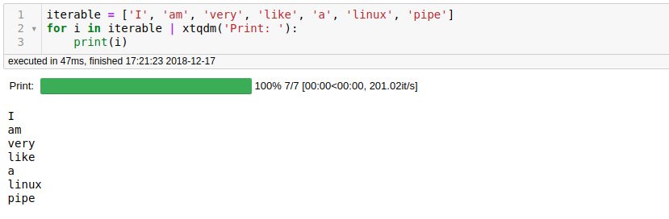

<h1 align = "center">:rocket: X-plan :facepunch:</h1>

---

## Install
```
pip install x-plan
```
## Usage
#### `from xplan.iterable import *`
```python
@X
def xfunc1(x):
    _ = x.split()
    print(_)
    return _
@X
def xfunc2(x):
    _ = '>>'.join(x)
    print(_)
    return _

'I am very like a linux pipe' | xfunc1 | xfunc2
```
- `xtqdm`

    

- `xfilter / xmap / xsort / xreduce`
```python
iterable | xfilter(lambda x: len(x) > 1) | xmap(str.upper) | xsort | xreduce(lambda x, y: x + '-' + y)

'AM-LIKE-LINUX-PIPE-VERY'
```

- `xsummary`
```python
iterable | xsummary

counts               7
uniques              7
missing              0
missing_perc        0%
types           unique
Name: iterable, dtype: object
```
- ...

